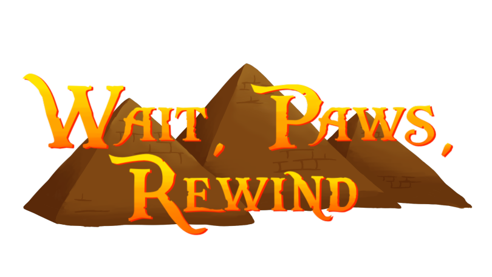
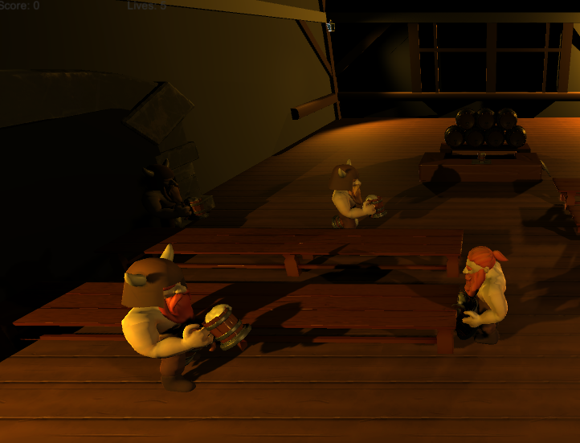

## About Me
Hello I'm Benjamin, I'm a Game Programmer and Narrative Designer. I've loved writing and game design for as long as I can remember which drew me to learn Game Programming at the Academy of Interactive Entertainment.

#### Links
* [LinkedIn](https://www.linkedin.com/in/benjamin-brownlie)
* [Resume](https://raw.githubusercontent.com/file:///C:/Users/s208049/Documents/Projects/benbrownlie/Assets/Images/Resume.pdf)

## Projects

## Wait, Paws, Rewind.

A project I worked on at the end of my second year at the Academy of Interactive Entertainment(AIE). I developed all the movement based mechanics and the targeting system present in-game.

* [Itch.io Page](https://osirisstudios.itch.io/wait-paws-rewind)

## Taverner.

A project I worked on at the end of my first year at the Academy of Interactive Entertainment(AIE). I developed the Movement, Drink Serving, and Point Systems present in game.

* [Repository](https://github.com/CamRobinson1103/Taverner)
* [Itch.io Page](https://lthan.itch.io/taverner)
